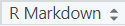

```{r setup, include=FALSE}
library(knitr)
library(tidyverse)
opts_chunk$set(echo = TRUE, warning = FALSE, message = FALSE)
```

## Goals {.emphasized data-background=img/DEFOCUSED.png data-background-size=cover .flexbox .vcenter}

- You know what mardown is.
- You know what you can do with Rmarkdown.
- You can create your own Rmarkdown files.

# Markdown and Rmarkdown

## What is **markdown**? {.build}

>- It is a very simple document markup language.
>- Other examples are **html**, or **rtf**.
>- **markdown** was developed in 2004 by John Gruber as an easy way to create texts on websites.
>- Texts in **mardown** are converted (translated) to other markup languages before they are turned to webpages or documents.
>- Due to its simplicity, **markdown** can be converted to *html*, *latex*, *docx*, *rtf*, ect. files.
>- Markdown is widely applied on various sites (e.g., ***GitHub, Reddit, Diaspora, OpenStreetMap, sourceForge***).

## Rmarkdown {.build}

- Rmarkdown is an extension to markdown.
- Specifically developed to combine data analyses (scripts and output) within a document.
- Think of it as an integration of a textprocessing programm and R code.
- You can write a text and implement tables, plots, figures etc. analysed with R.

## Why use Rmarkdown?

- Rmarkdown helps to make your research:
    - Transparent
    - Reproducible
    - Organized
    - Communicatable
    
## Why use Rmarkdown?

- You can create individualized reports
    - E.g. results with a standard text for each participant in a study comprising her own data
    - E.g. individual analyses for each single school or classroom but with a common text.
    - You can even adapt textblocks depending on paramters and specific results (e.g. skip certain passages for special schools but not for primary schools)

## Task {.build}

Before we go on, you have to start your first Rmarkdown document:

- Create a new source file in R. Choose ***"Text File"*** as the format.  
File  New File  Text File
- Save it under the name "first_mardown.Rmd"  
(you can name it as you like as long as it ends with ".Rmd").
- Now, at the lower right corner of your source pannel you should find  as an indicator of the file type.
- Also, at the top of the sorce file you should find 


# Basic markdown formating

## Basic markdown: header

- Normally written text appears as unformated text.
- You can format text into a header with the `#` symbol:

```{r eval = FALSE}
# A level one header
## A level two header
### A level three header
#### A level four header
```

## Basic markdown: Emphasise

- Italic text is put between `*` symbols (or `_`).
- Bold text between `**` symbols.
- Italic and bold text between `***` symbols.

`This is *italic* this is **bold**, and ***this is both!!!***.`

This is *italic* this is **bold**, and ***this is both!!!***.

## Basic markdown: Lists {.smaller}

```{r eval = FALSE}
An unordered list:

- Helmut
- Gerhard
- Angela

An ordered list:

1. Bush
2. Obama
3. Trump

Combined:
  
1. Sour
  - Lime
  - Envy
2. Sweet
  - Honey
  - love
```

# Rmarkdown

## Chunks

- `Chunks` are portions of R code within a markdown file.
- A chunk for R has the following structure:

\```{r}  
\# Here comes the R code  
\```  

- An empty chunk can be inserted directly thorugh the `Insert` button.

## Chunk Options

- Chunk options specify the "behaviour" of a chunk.
- They are put behind the leading "r" and are seprated by ",".

e.g.:  

\```{r echo = FALSE}  
\# Here comes the R code  
\```

- `echo = FALSE` suppresses the inclusion of the original R code and only output is reported.
- `include = FALSE` executes the R code but does not report anything
- `message = FALSE` excludes addidtional messages given by a function.
- `warning = FALSE` exclude warnings created by a function.

## YAML (YAML is not a markup language) {.build}

- Through YAML you can set several document parameters. 
- YAML is like a document header at the beginning of an Rmarkdown file. It is put between leading and ending "---".

```{r eval = FALSE}
---
  
---
```

Some possible parameters:

- title: "My first document"
- author: "Jürgen Wilbert"
- date: 12.12.2019
- abstract


## Additional ressources for Rmarkdown

- Cheatsheet:  
https://rstudio.com/wp-content/uploads/2015/02/rmarkdown-cheatsheet.pdf
- R Markdown: The Definitive Guide  
https://bookdown.org/yihui/rmarkdown/


## Task

- Download the ***Rmarkdown silly example*** from the R moodle course.
- Save it to your project folder.
- Open it in RStudio.
- Knit an html and Word Docx file from it.
- Read through the code and make sure you understand all of it :-)
