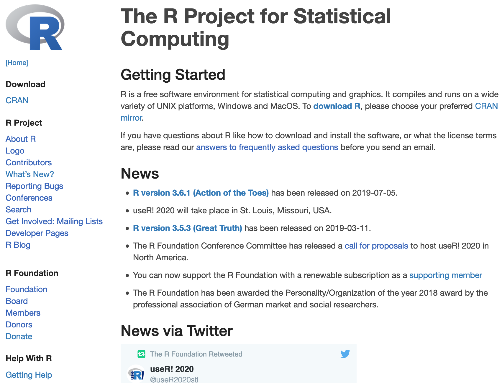
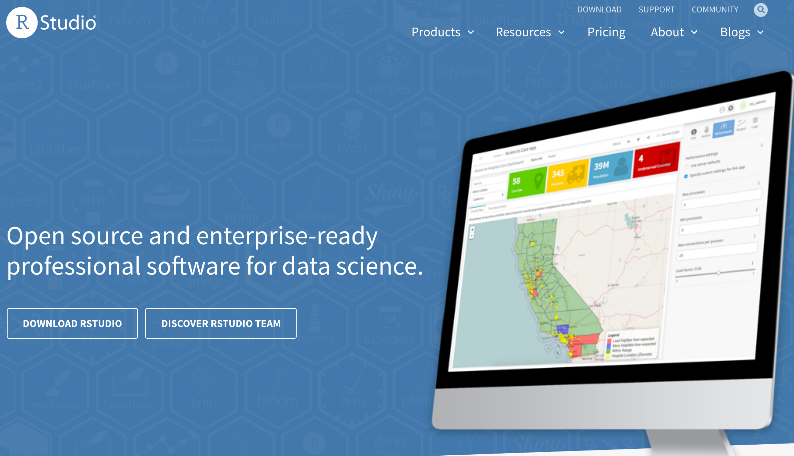

```{r setup, include=FALSE}
knitr::opts_chunk$set(echo = FALSE)
```

## Todays goals

- Introduction to the idea of Data Science
- Getting an overview of the content of this seminar
- Installing R on your computer
- Installing R-Studio on your computer
- Overview of R-Studio

## What is R? {.build}

- A tool for statistical computation (like SPSS, Mplus, STATA ...)
- A programming language
- An idea and a community that shares common ideas about science


## Statements {.build}

- Science should be truthfull
- Science should be diligent
- Science should be transparent
- Science should be reproducible
- Science should be communicated
- Science should be accessible
- Science should be open

## R (and R studio) help with ...

- Science should be truthfull
- Science should be diligent
- <div class="red2">**Science should be transparent**</div>
- <div class="red2">**Science should be reproducible**</div>
- <div class="red2">**Science should be communicated**</div>
- <div class="red2">**Science should be accessible**</div>
- Science should be open

# What R can do

## Any kind of statistical analyses:

- Descriptive stats
- Modelling
- Inferential stats
- Manage and organize data
- Large data (large scale / big data / EEG / fMRT)
- Small data (experimental data / questionnaire data / single-case data)

## Present data

- Visualize data and results
- Keep a notebook of your research and analyses
- Write reports, including stats
- Write presentations
- Write books
- Build interactive websites
- Connect with various other software and internet tools


# Schedule

---


```{r include = FALSE}
schedule <- readxl::read_xlsx("schedule.xlsx")

```

```{r}
knitr::kable(schedule[1:7,])
```

---

```{r}
knitr::kable(schedule[8:nrow(schedule),])
```


# Installation of R and R-Studio

## Installing R

[__R homepage:__ *https://www.r-project.org/*](https://www.r-project.org/)


```{r, out.width = "800px"}

```

## Installing R-Studio

[__R-Studio homepage:__ *https://rstudio.com/*](https://rstudio.com/)

```{r, out.width = "800px"}

```

## R for Data science

[R for Data Science](https://r4ds.had.co.nz/)

```{r, out.width = "400px"}
knitr::include_graphics("img/cover_r4ds.png")
```